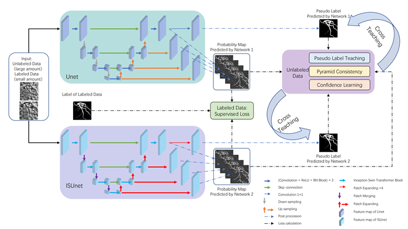
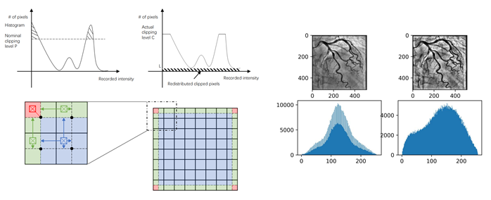
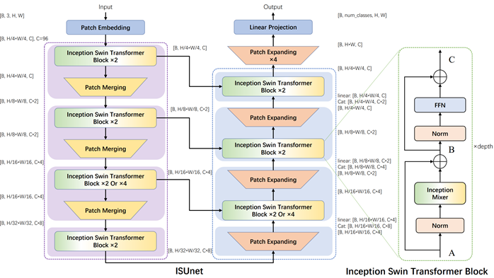
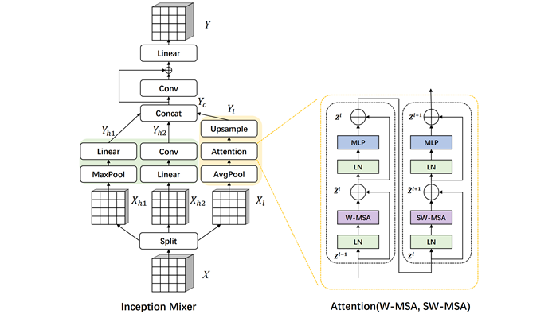
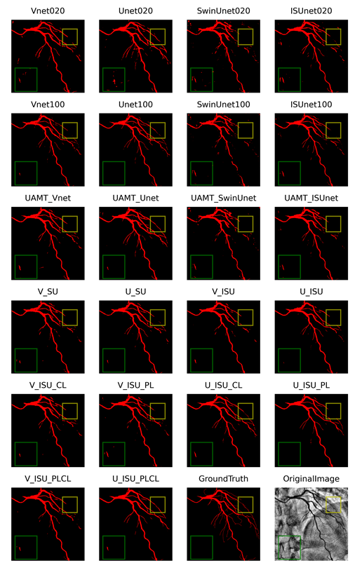

# SSL4DSA

This repository is the Python (Pytorch) implement of paper 'Yao Pu, et al., Semi-supervised Segmentation of Coronary DSA using Mixed Networks and Multi-strategies'(https://www.sciencedirect.com/science/article/pii/S001048252201201X). **Semi-Supervised Learning** (SSL), **Inception Swin-Unet** (ISUnet), **Pyramid consistency Learning** (PL), & **Confidence Learning** (CL) are adopted in to segment the coronary artery of human in Digital Subtraction Angiography (DSA) images.

```
@article{pu2022semi,
  title={Semi-supervised segmentation of coronary DSA using mixed networks and multi-strategies},
  author={Pu, Yao and Zhang, Qinghua and Qian, Cheng and Zeng, Quan and Li, Na and Zhang, Lijuan and Zhou, Shoujun},
  journal={Computers in Biology and Medicine},
  pages={106493},
  year={2022},
  publisher={Elsevier}
}
```

## 0. Framework



## 1. Requirements

```
Python: 3.8.10
torch: 1.11.0+cu113
cleanlab: 2.0.0
tensorboardX: 2.5
tqdm: 4.64.0
einops: 0.4.1
timm: 0.5.4
ml-collections: 0.1.1
...
```

## 2. Contents

```bash
.
│  .gitignore
│  README.md
│
├─dada
│  └─CA_DSA
│      ├─LCA
│      │  │  test.list
│      │  │  train.list
│      │  │
│      │  ├─data
│      │  │     000.bmp
│      │  │     ...
│      │  │     150.bmp
│      │  │  
│      │  ├─enhance
│      │  ├─label
│      │  │     000.bmp
│      │  │     ...
│      │  │     150.bmp
│      │  └─skeleton
│      └─RCA
│          │  test.list
│          │  train.list
│          │
│          ├─data
│          │    000.bmp
│          │    ...
│          │    150.bmp
│          ├─enhance
│          ├─label
│          │    000.bmp
│          │    ...
│          │    150.bmp
│          └─skeleton
│  
├─code
│  │  dataset.py                                    # load dataset
│  │  histogram.ipynb
│  │  maxpool.ipynb
│  │  preprocess.py                                 # CLAHE preprocessing
│  │  train_supervised_softmax.py                   # FSL OneNetwork
│  │  train_semisupervised_UAMT.py                  # SSL TwoSameNetworks UAMT
│  │  train_semisupervised_CNN_Transformer.py       # SSL CNN_SwinUnet
│  │  train_semisupervised_CNN_Transformer_CL.py    # SSL CNN_ISUnet_CL
│  │  train_semisupervised_CNN_Transformer_PL.py    # SSL CNN_ISUnet_PL
│  │  train_semisupervised_CNN_Transformer_PLCL.py  # SSL CNN_ISUnet_PLCL: the MAIN training file
│  │  test_model.py                                 # the testing file for single_out_network
│  │  test_model_multiout.py                        # the MAIN testing file for multi_out_network
│  │  run.sh
│  │  
│  ├─networks
│  │  │  __init__.py
│  │  │  Unet.py
│  │  │  Unet_4out.py
│  │  │  Vnet.py
│  │  │  Vnet_4out.py
│  │  │  Unetpp.py
│  │  │  AttUnet.py
│  │  │
│  │  ├─SwinUnet
│  │  │      swin_transformer_unet_skip_expand_decoder_sys.py
│  │  │      vision_transformer.py
│  │  │
│  │  └─InceptionSwinUnet
│  │          InceptionSwinUnet_v1.py
│  │          InceptionSwinUnet_v2.py
│  │          InceptionSwinUnet_v2_4out.py
│  │          InceptionSwinUnet_v3.py
│  │          InceptionSwinUnet_v3_4out.py           # the MAIN network (ISUnet) file
│  │
│  └─utils
│          generateCenterline.py
│          losses.py
│          ramps.py
│  
├─model
│    ├─predictions
│    ├─semisupervised
│    └─supervised
│
└─img
       CLAHE.png
       Framework.png
       ISUnet.png
       ITM.png
       Result.png
```

## 3. Steps

### 3.1. Pre-Processing

[code/prepocess.py](code/preprocess.py) enhance raw DSA by approach [CHALE](https://en.wikipedia.org/wiki/Adaptive_histogram_equalization#Contrast_Limited_AHE) (Contrast Limited Adaptive Histogram Equalization).



### 3.2. Dataloader

[code/dataset.py](code/dataset.py) load the data & do some transform.

### 3.3. Networks

[code/networks/](code/networks/) includes all the networks we used in the experiments.

- [Unet](code/networks/Unet.py)
- [Unet_4out](code/networks/Unet_4out.py)
- [Vnet](code/networks/Vnet.py)
- [Vnet_4out](code/networks/Vnet_4out.py)
- [Unet++](code/networks/Unetpp.py)
- [AttentionUnet](code/networks/AttUnet.py)
- [SwinUnet](code/networks/swinUnet/swin_transformer_unet_skip_expand_decoder_sys.py)
- [ISUnetV1](code/networks/InceptionSwinUnet/InceptionSwinUnet_v1.py)
- [ISUnetV2](code/networks/InceptionSwinUnet/InceptionSwinUnet_v2.py)
- [ISUnetV3](code/networks/InceptionSwinUnet/InceptionSwinUnet_v3.py)
- [ISUnetV2_4out](code/networks/InceptionSwinUnet/InceptionSwinUnet_v2_4out.py)
- [ISUnetV3_4out](code/networks/InceptionSwinUnet/InceptionSwinUnet_v3_4out.py)





### 3.4. Training

De-comment training lines in the [code/run.sh](code/run.sh) and run it.

```bash
cd code
bash run.sh
```

Or run the python file directly.

```bash
cd code

# left coronary artery (LCA)
python train_semisupervised_CNN_Transformer_PLCL.py --root_path='../data/CA_DSA/LCA/' --exp='semisupervised/CNN_Transformer_PLCL/unet4out_isunetv5/LCA' --nets='unet4out_isunetv5' --batch_size=2 --gpus='1,2' --labeled_num=20 

# right coronary artery (RCA)
python train_semisupervised_CNN_Transformer_PLCL.py --root_path='../data/CA_DSA/RCA/' --exp='semisupervised/CNN_Transformer_PLCL/unet4out_isunetv5/RCA' --nets='unet4out_isunetv5' --batch_size=2 --gpus='1,2' --labeled_num=20 
```

### 3.5. Testing

De-comment Testing lines in the [code/run.sh](code/run.sh) and run it.

```bash
cd code
bash run.sh
```

Or run the python file directly.

```bash
cd code

# load LCA model1
python test_model_multiout.py --root_path='../data/CA_DSA/LCA/' --model='semisupervised/CNN_Transformer_PLCL/unet4out_isunetv5/LCA' --whichmodel='model1'

# load LCA model2
python test_model_multiout.py --root_path='../data/CA_DSA/LCA/' --model='semisupervised/CNN_Transformer_PLCL/unet4out_isunetv5/LCA' --whichmodel='model2'

# load RCA model1
python test_model_multiout.py --root_path='../data/CA_DSA/RCA/' --model='semisupervised/CNN_Transformer_PLCL/unet4out_isunetv5/RCA' --whichmodel='model1'

# load RCA model2
python test_model_multiout.py --root_path='../data/CA_DSA/RCA/' --model='semisupervised/CNN_Transformer_PLCL/unet4out_isunetv5/RCA' --whichmodel='model2'
```

## 4.Result



| Method          |                           |         | LCA    |        |    |         | RCA    |        |
| --------------- | ------------------------- | ------- | ------ | ------ | -- | ------- | ------ | ------ |
|                 |                           | DSC(%)↑ | SE(%)↑ | SP(%)↑ |    | DSC(%)↑ | SE(%)↑ | SP(%)↑ |
| supervised      | Vnet_20                   | 72.51   | 74.92  | 97.75  | 　 | 78.04   | 75.65  | 99.10  |
|                 | Vnet_100                  | 75.87   | 73.10  | **98.60**  |    | 81.37   | **81.70**  | 99.04  |
|                 | Unet_20                   | 70.46   | **78.05**  | 96.92  |    | 78.96   | 78.03  | 99.03  |
|                 | Unet_100                  | **76.48**   | 75.17  | 98.48  |    | **82.15**   | **81.23**  | 99.17  |
|                 | SwinUnet_20               | 69.49   | 72.69  | 97.41  |    | 70.87   | 63.72  | 99.21  |
|                 | SwinUnet_100              | 71.40   | 69.16  | 98.27  |    | 77.17   | 78.18  | 98.78  |
|                 | ISUnet_20                 | 72.27   | 77.40  | 97.42  |    | 77.41   | 75.70  | 99.01  |
|                 | ISUnet_100                | 74.92   | 73.96  | 98.35  |    | 80.24   | 80.54  | 98.99  |
| semi-supervised | UAMT_Vnet_20/80           | 73.81   | 75.80  | 97.88  | 　 | 78.72   | 74.25  | 99.30  |
|                 | UAMT_Unet_20/80           | 73.78   | **77.90**  | 97.62  |    | 79.81   | 77.30  | 99.19  |
|                 | UAMT_Swinunet_20/80       | 71.82   | 71.20  | 98.09  |    | 73.24   | 63.89  | **99.49**  |
|                 | UAMT_ISU_20/80            | 74.75   | 74.27  | 98.27  |    | 77.20   | 70.12  | 99.44  |
|                 | Vnet_SwinU_20/80          | 74.61   | 74.33  | 98.24  | 　 | 78.09   | 72.12  | 99.39  |
|                 | Unet_SwinU_20/80          | 75.66   | 75.79  | 98.26  |    | 79.20   | 73.05  | **99.45**  |
|                 | Vnet_ISU_20/80            | 74.58   | 73.00  | 98.40  |    | 78.30   | 72.76  | 99.36  |
|                 | Unet_ISU_20/80            | 75.65   | 74.24  | 98.44  |    | 80.11   | 74.90  | 99.41  |
|                 | Vnet_ISU_PLCL_20/80(ours) | 75.04   | 76.10  | 98.10  |    | 78.70   | 72.75  | 99.42  |
|                 | Unet_ISU_PLCL_20/80(ours) | **76.71**   | 75.51  | **98.50**  | 　 | **81.48**   | 77.81  | 99.35  |
